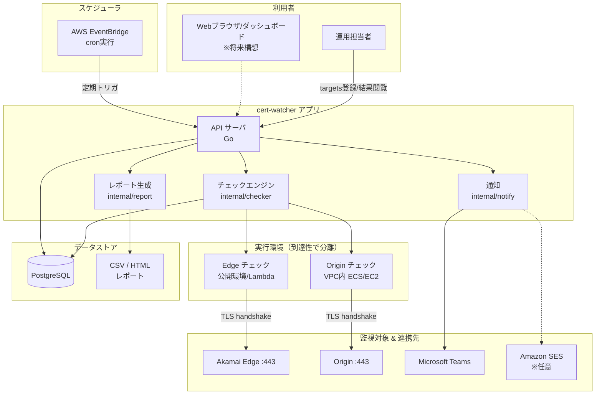
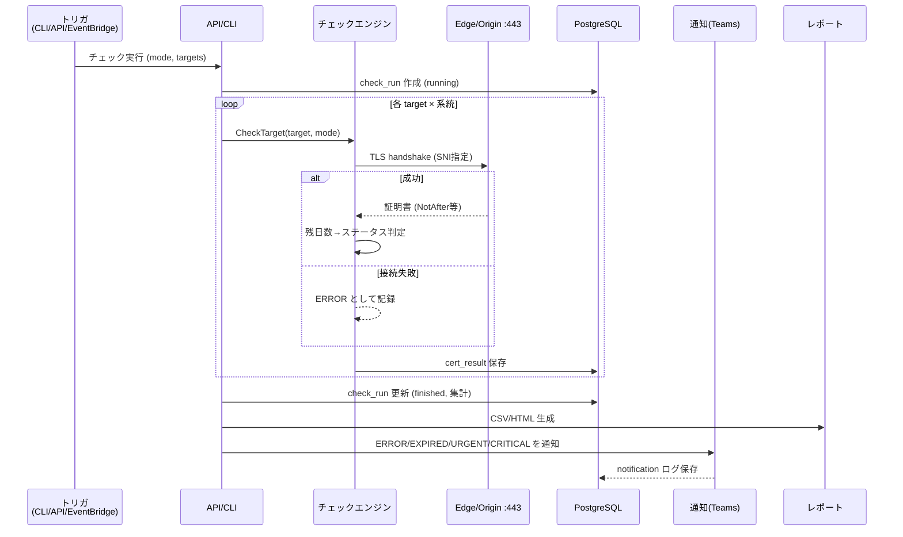
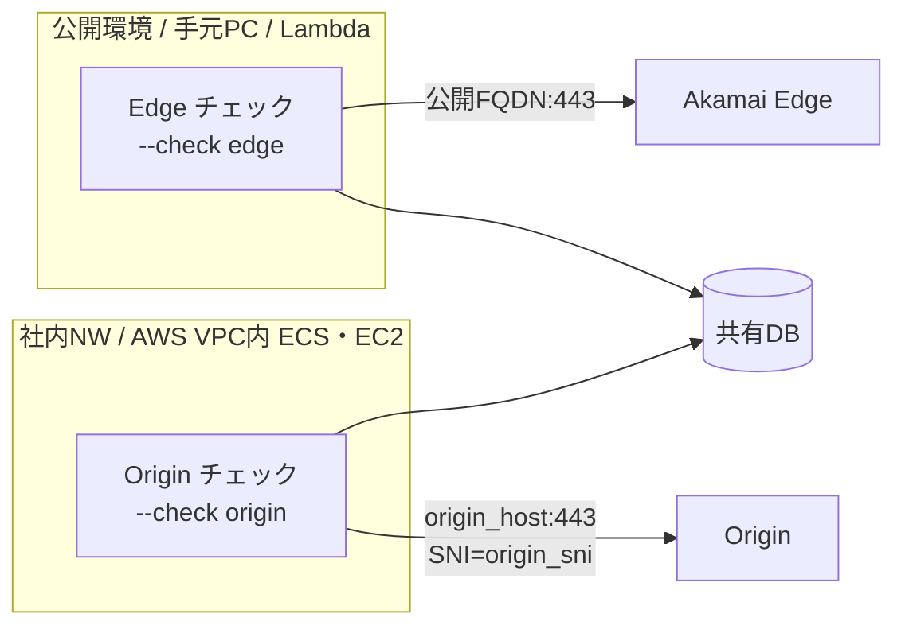
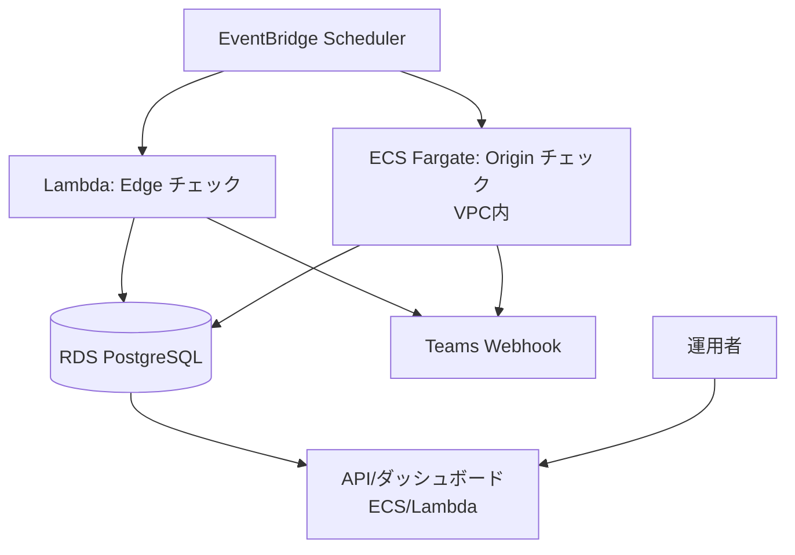

# システム設計図 — Akamai-Origin Certificate Watcher

現状の CLI を「コアエンジン」とし、その周辺に API / DB / スケジューラ / 通知を配置した **目標アーキテクチャ** を示す。

---

## 1. 全体構成図

---

## 2. コンポーネント責務

| コンポーネント | 責務 | 現状の対応物 |
|----------------|------|--------------|
| **チェックエンジン** | TLS接続して証明書取得・期限判定。Edge/Origin の系統分離 | `internal/checker` ✅ |
| **レポート生成** | CSV / HTML レポート出力 | `internal/report` ✅ |
| **通知** | ERROR/EXPIRED/URGENT/CRITICAL を Teams 通知 | `internal/notify` ✅ |
| **モデル** | Target / 結果 / ステータス判定 | `internal/model` ✅ |
| **CLI** | コマンド実行・フラグ処理 | `cmd/cert-watcher` ✅ |
| **API サーバ** | targets管理・チェック実行・結果配信 | ⬜ 将来（`internal/api`） |
| **永続化** | targets・実行履歴・結果・通知ログを保存 | ⬜ 将来（PostgreSQL） |
| **スケジューラ** | 定期実行トリガ | cron/タスクスケジューラ ✅ / EventBridge ⬜ |

---

## 3. データフロー（1回のチェック）

---

## 4. Edge / Origin 実行環境の分離

Origin は **SiteShield の許可IP・Security Group・社内NW** などにより、任意の場所からは到達できないことがある。
そのため `--check`（API では `mode`）で系統を分け、それぞれ到達可能な実行環境で動かす。

- **Edge チェック**: 公開 FQDN へ。どこからでも到達可能。
- **Origin チェック**: Origin への到達経路を持つ環境（VPC内など）で実行。
- 双方の結果を同一 `check_run` / 同一 DB に集約してレポート化する。

---

## 5. デプロイ構成（AWS 例）

- 小規模（〜数百サイト）なら **Lambda + EventBridge** でほぼ無料枠内。
- Origin が VPC 内のみ到達可なら **ECS Fargate（VPC内）** で Origin チェックを実行。
- 状態は **RDS PostgreSQL** に集約。

---

## 6. 設計上の重要な決定

| 決定 | 理由 |
|------|------|
| TLS検証は **InsecureSkipVerify=true** | 期限切れ・自己署名でも「証明書情報そのもの」を取得するため。期限判定は自前で実施 |
| 1対象失敗で全体停止しない | 監視ツールとしての堅牢性。失敗は `ERROR` として記録し継続 |
| Edge/Origin の実行環境を分離可能に | Origin の到達性制約（SiteShield/VPC）に対応 |
| 通知は ERROR/EXPIRED/URGENT/CRITICAL のみ | 通知過多を防ぎ、要対応だけを届ける |
| 自動更新はしない | 誤更新による事故影響が大きいため、検出・確認に専念 |
