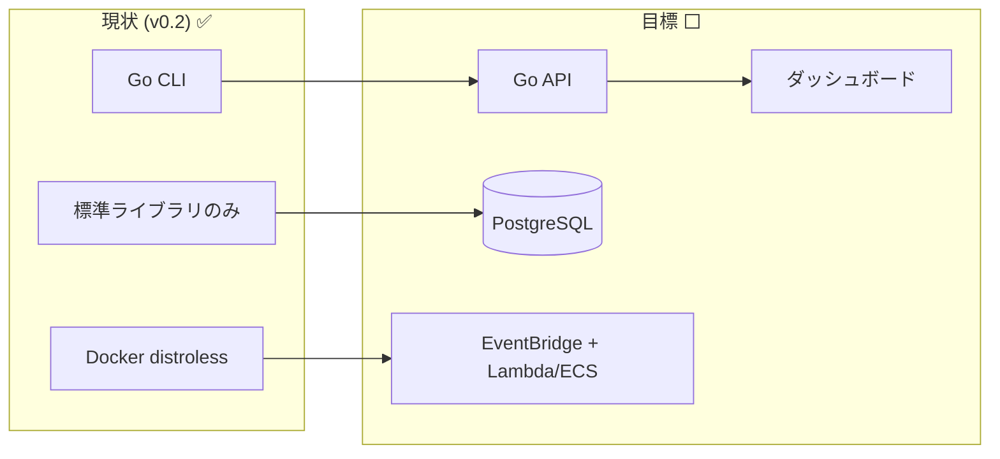

# 技術スタック — Akamai-Origin Certificate Watcher

## 1. 全体一覧

| レイヤー | 採用技術 | 状態 | 選定理由 |
|----------|----------|------|----------|
| 言語 | **Go 1.23+** | ✅ 採用済 | 単一バイナリ配布・クロスコンパイル・標準ライブラリで TLS/CSV/HTML が完結 |
| TLS/証明書 | **標準 `crypto/tls`, `crypto/x509`** | ✅ | 外部依存なしで証明書取得・解析が可能 |
| CLI | **標準 `flag`** | ✅ | 依存追加なし。サブコマンド `check` を自前ディスパッチ |
| レポート | **標準 `encoding/csv`, `html/template`** | ✅ | 追加依存なしで CSV/HTML 生成。XSS安全（自動エスケープ） |
| 通知 | **標準 `net/http`（Teams MessageCard）** | ✅ | Webhook POST のみ。任意で Amazon SES メール |
| DB | **PostgreSQL 16** | ⬜ 将来 | 履歴・集計に強く、JSON型/インデックスが豊富。RDS で運用容易 |
| DBアクセス | **標準 `database/sql` + `pgx`** | ⬜ 将来 | 軽量。ORM は採用せず SQL を明示 |
| マイグレーション | **goose** または **golang-migrate** | ⬜ 将来 | SQLベースで差分管理しやすい |
| API ルータ | **標準 `net/http`（必要なら `chi`）** | ⬜ 将来 | まず標準で。ミドルウェアが増えたら chi |
| スケジューラ | **AWS EventBridge Scheduler** | ⬜ 将来 | cron式で定期実行。サーバレスで低コスト |
| 実行基盤 | **AWS Lambda（Edge）/ ECS Fargate（Origin・VPC内）** | ⬜ 将来 | Edge は軽量、Origin は到達性のため VPC 内 |
| コンテナ | **Docker（distroless）** | ✅ | 最小・CA証明書同梱。単一バイナリと相性良 |
| IaC | **Terraform** または **AWS SAM** | ⬜ 将来 | 環境の再現性 |
| CI/CD | **GitHub Actions** | ⬜ 将来 | build/vet/test/クロスコンパイル/イメージpush |
| テスト | **標準 `testing` + `httptest`** | ✅ | 依存なしでユニット/HTTPモック |
| フロント（任意） | **Go html/template（SSR）or Next.js** | ⬜ 将来構想 | まずは SSR の軽量ダッシュボード。要件次第で SPA |

---

## 2. 選定方針

### 2.1 「標準ライブラリ中心」を貫く理由
- 証明書監視は **依存が少ないほど信頼でき、長く保守できる**
- 単一バイナリ配布（Windows/Linux/macOS）が容易
- セキュリティパッチ追従の負担が小さい

### 2.2 外部ライブラリを足すときの基準
以下に該当する場合のみ追加を検討する。
1. 標準では実装が著しく煩雑（例: 高機能ルーティング → `chi`）
2. 広く使われ保守が活発（メンテ・スター・採用実績）
3. ライセンスが許容範囲（MIT/BSD/Apache-2.0）

### 2.3 DB を PostgreSQL とする理由
- 期限・履歴・集計クエリに強い（時系列の `cert_results` 集計）
- `ENUM` 相当・部分インデックス・JSONB が使える
- AWS RDS / Aurora で運用が容易、Neon 等のサーバレスPostgresも選択可

---

## 3. ランタイム / バージョン方針

| 項目 | 方針 |
|------|------|
| Go | 1.23 系を基準（`go.mod` は下限 1.21 を許容） |
| PostgreSQL | 16 系 |
| Docker ベース | build: `golang:1.23-alpine` / runtime: `gcr.io/distroless/static-debian12:nonroot` |
| 対応OS | Windows / Linux / macOS（CLI）。サーバ側は Linux |

---

## 4. 現状 vs 目標

現状は **依存ゼロの CLI**。目標構成でも追加依存は最小限（pgx・マイグレーションツール・必要なら chi）に抑える。
