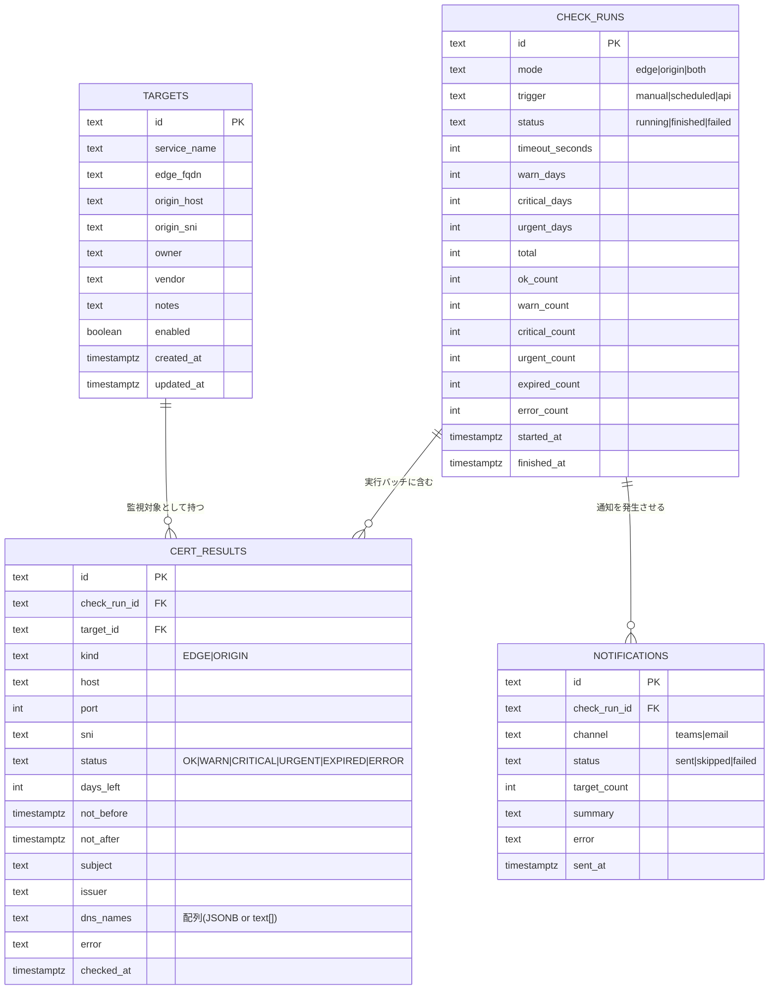
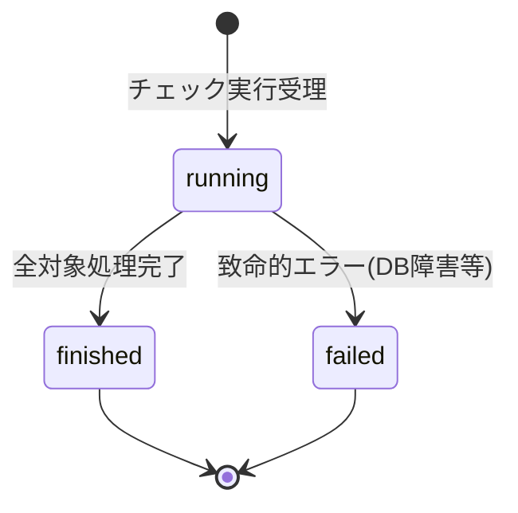

# ER 図 — Akamai-Origin Certificate Watcher

> 将来構成（PostgreSQL）のデータモデル。現状の CLI は CSV 入力 → メモリ処理のため DB を持たないが、目標構成では以下を永続化する。

## 1. エンティティ関連図

---

## 2. リレーション要点

| 関係 | カーディナリティ | 説明 |
|------|------------------|------|
| `targets` → `cert_results` | 1 : N | 1つの監視対象は多数の検査結果（実行ごと×Edge/Origin）を持つ |
| `check_runs` → `cert_results` | 1 : N | 1回の実行は複数の証明書結果を含む |
| `check_runs` → `notifications` | 1 : N | 1回の実行から複数チャネルの通知が発生し得る |

- `cert_results` は `(check_run_id, target_id, kind)` の組で一意。
- `target_id` は `ON DELETE SET NULL`（対象削除後も過去の証跡を残す）。
- 「最新結果」は `cert_results` を `target_id, kind` ごとに `checked_at` 降順で取得して得る。

---

## 3. 状態遷移（check_runs.status）

> 個々の対象の接続失敗は `cert_results.status = ERROR` として記録され、`check_runs` 自体は `finished` になる（1対象失敗で全体を止めない設計）。
