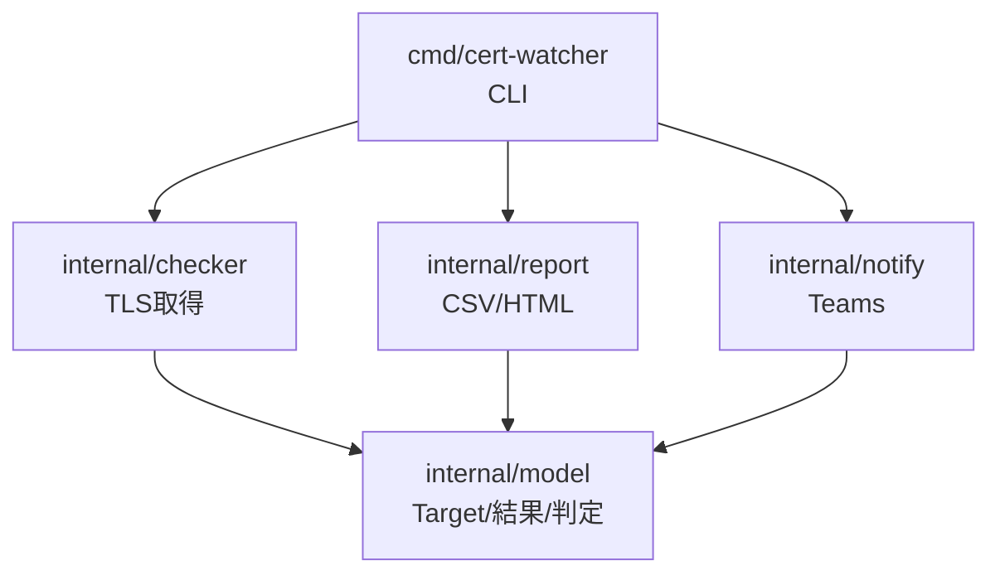
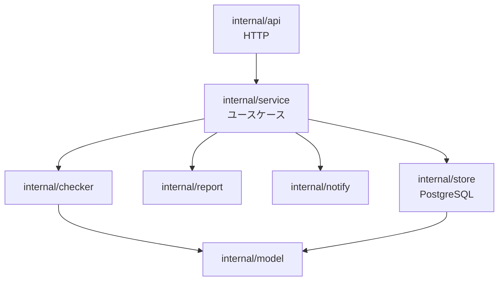

# ディレクトリ構成図 — Akamai-Origin Certificate Watcher

## 1. 現状（v0.2 / CLI）✅

```
cert-watcher/
├── README.md                       # 使い方・フォーマット・運用手順
├── Dockerfile                      # マルチステージ + distroless
├── .dockerignore
├── go.mod                          # module cert-watcher (Go 1.21+)
├── config/
│   └── targets.csv                 # 監視対象サンプル
├── cmd/
│   └── cert-watcher/
│       ├── main.go                 # CLI エントリ・フラグ・並行実行・ソート・通知
│       └── main_test.go            # sortResults テスト
├── internal/
│   ├── checker/
│   │   ├── tls_checker.go          # TLS接続・証明書取得・CheckMode(edge/origin/both)
│   │   └── tls_checker_test.go
│   ├── model/
│   │   ├── target.go               # 入力CSV読込・Target
│   │   ├── target_test.go
│   │   ├── result.go               # CertResult・ステータス判定・ソート重み
│   │   └── result_test.go
│   ├── notify/
│   │   ├── teams.go                # Teams通知(MessageCard, ERROR/EXPIRED/URGENT/CRITICAL)
│   │   └── teams_test.go
│   └── report/
│       ├── csv_report.go           # CSV出力
│       └── html_report.go          # HTML出力(色分け・サマリ)
├── output/                         # 生成物(CSV/HTML) ※実行時生成
└── docs/                           # 設計ドキュメント群（本書を含む）
    ├── README.md
    ├── 01_concept.md
    ├── 02_architecture.md
    ├── 03_tech_stack.md
    ├── 04_api_spec.md
    ├── 05_er_diagram.md
    ├── 06_table_design.md
    └── 07_directory_structure.md
```

### レイヤー責務（現状）



---

## 2. 目標構成（API + DB 追加時）⬜

既存 `internal/` を **再利用するライブラリ** とし、API サーバ・永続化・マイグレーション・IaC を追加する。

```
cert-watcher/
├── cmd/
│   ├── cert-watcher/               # 既存CLI（そのまま）
│   │   └── main.go
│   └── cert-watcher-api/           # ★追加: APIサーバのエントリ
│       └── main.go
├── internal/
│   ├── checker/                    # 既存（再利用）
│   ├── model/                      # 既存（再利用 / DBモデルへ拡張）
│   ├── notify/                     # 既存（再利用）
│   ├── report/                     # 既存（再利用）
│   ├── api/                        # ★追加: HTTPハンドラ・ルーティング
│   │   ├── router.go
│   │   ├── targets_handler.go
│   │   ├── checks_handler.go
│   │   └── middleware.go           # 認証・ログ・リカバリ
│   ├── store/                      # ★追加: 永続化(PostgreSQL)
│   │   ├── store.go                # インターフェース
│   │   ├── targets_store.go
│   │   ├── checkruns_store.go
│   │   └── results_store.go
│   └── service/                    # ★追加: ユースケース(実行→保存→通知の調整)
│       └── check_service.go
├── migrations/                     # ★追加: SQLマイグレーション
│   ├── 0001_init.up.sql
│   └── 0001_init.down.sql
├── infra/                          # ★追加: IaC
│   ├── terraform/                  # or aws-sam/
│   └── README.md
├── .github/
│   └── workflows/
│       └── ci.yml                  # ★追加: build/vet/test/cross-compile
├── web/                            # ★将来: ダッシュボード(SSR or SPA)
├── config/
├── docs/
├── Dockerfile                      # API用ステージを追加
├── go.mod
└── README.md
```

### 目標構成のレイヤー



---

## 3. 増設方針

| 追加物 | 配置 | 方針 |
|--------|------|------|
| API サーバ | `cmd/cert-watcher-api`, `internal/api` | CLI と同じエンジンを HTTP 化。CLIは残す |
| 永続化 | `internal/store` | `database/sql` + pgx。インターフェースで疎結合に |
| ユースケース | `internal/service` | 「実行→保存→レポート→通知」の調整役 |
| マイグレーション | `migrations/` | goose/golang-migrate。`06_table_design.md` を反映 |
| IaC | `infra/` | EventBridge + Lambda/ECS + RDS |
| CI | `.github/workflows` | 既存の build/vet/test を自動化 |
| ダッシュボード | `web/` | Phase 後半の任意機能 |

> 原則: **既存 `internal/checker・model・notify・report` は変更最小で再利用**。API/DB は外側に足す（ヘキサゴナル的な構成）。
