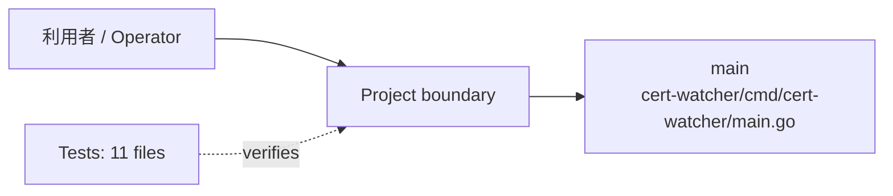
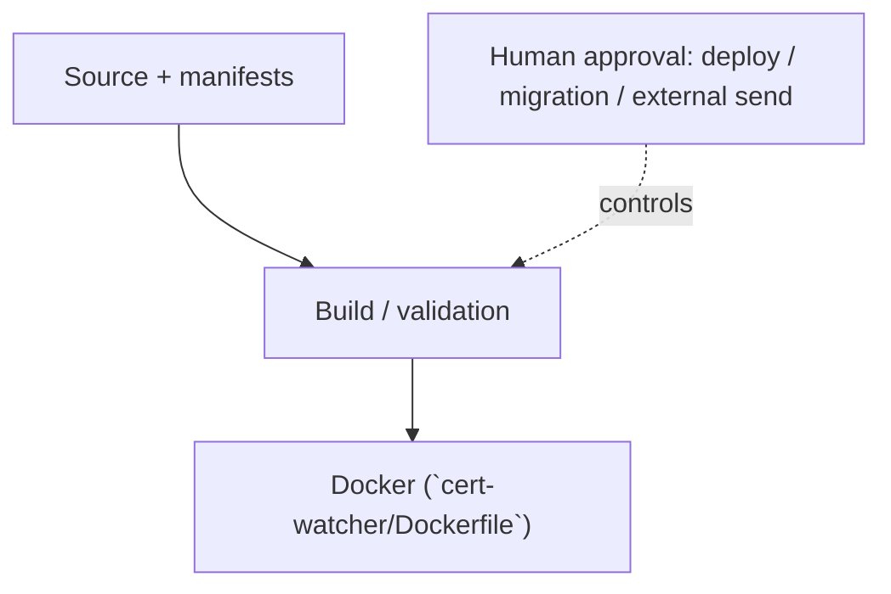

<!-- generated-by: scripts/generate_engineering_docs.py -->
# certificate_chekcer — アーキテクチャ・システム構成

> 生成日: 2026-07-15 / 対象: `certificate_chekcer` / 確度: [低]
> 実装・manifest・既存資料の静的棚卸しに基づく。外部サービスの稼働状態と本番構成は未検証。

## 論理アーキテクチャ

## 配備・実行構成

## コンポーネント責務

| Component | Path | 責務 |
|---|---|---|
| `main` | `cert-watcher/cmd/cert-watcher/main.go` | 実行entrypoint |

### 検出したruntime / service

- `Docker (`cert-watcher/Dockerfile`)`

## 実装境界

- UI/入口: UI route未検出
- API: API route未検出
- Data: 永続schema未検出
- External: integration名を静的検出できず

## セキュリティ境界

- 認証・回復性の実装シグナル: resilience (`cert-watcher/cmd/cert-watcher/main.go`), resilience (`cert-watcher/cmd/cert-watcher/main_test.go`), resilience (`cert-watcher/internal/notify/teams.go`), resilience (`cert-watcher/internal/checker/tls_checker.go`), resilience (`cert-watcher/internal/checker/tls_checker_test.go`), resilience (`cert-watcher/internal/runconfig/settings_test.go`), resilience (`cert-watcher/internal/runconfig/settings.go`)
- 設定名: example/sourceから未検出（値は収集していない）
- deploy、migration、外部送信、課金はHuman Approval Gate対象。
